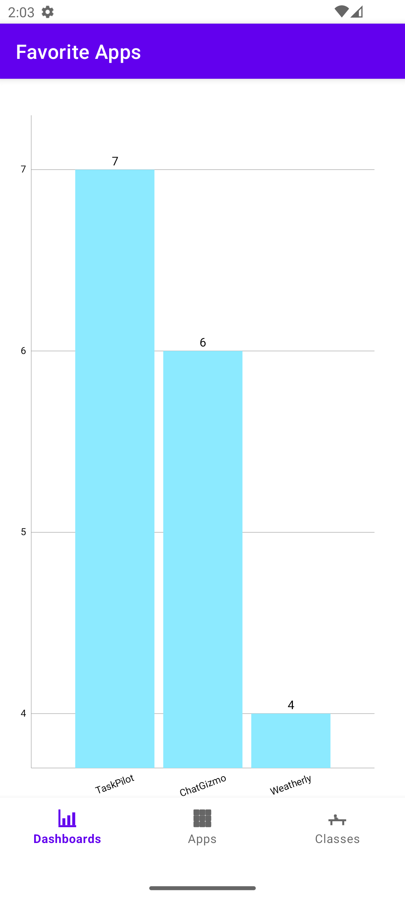

# Overview

NOTE: This is a work in progress... currently only using sample data

This app demonstrates how to use a database to keep track of apps that users select for
their discussion. 

We can provide historical data on app selection to how the popularity of apps changes over time.

# Screenshots

## Dashboard

The default screen that shows the top apps selected by users.

## Apps

The screen that shows all apps available for selection.

## Classes

The screen that shows all classes available for selection.

