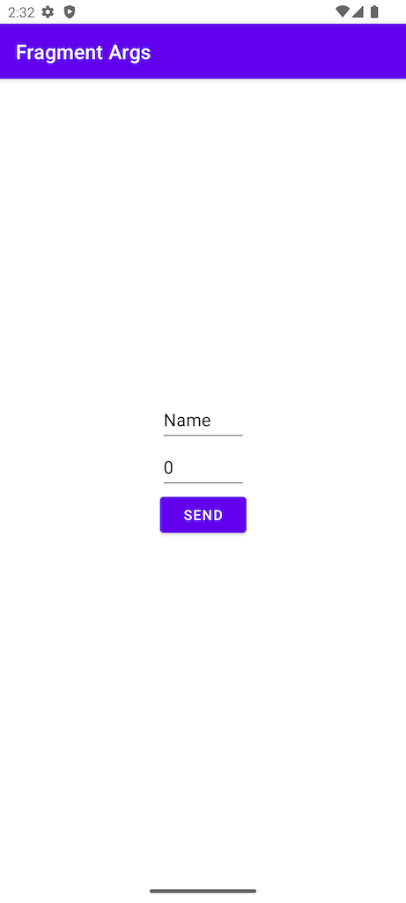
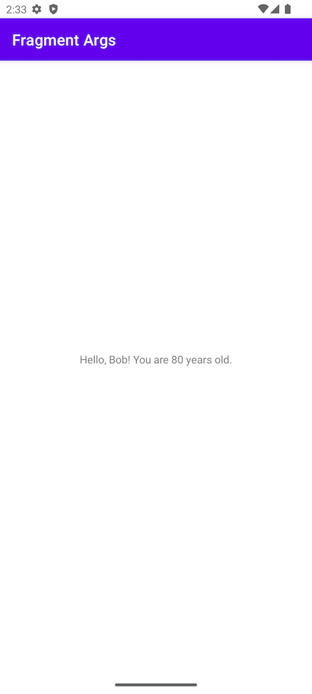

# Overview

A sample app that uses a fragment to display a form. Enter a name and age into the form and press the 
Send button to send the data to the next fragment.

### Fragment Form

### Fragment Message

