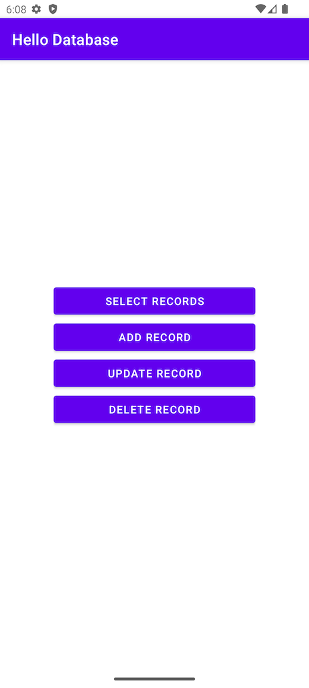
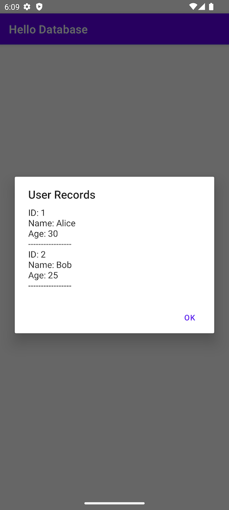
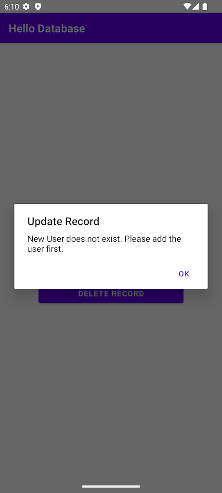
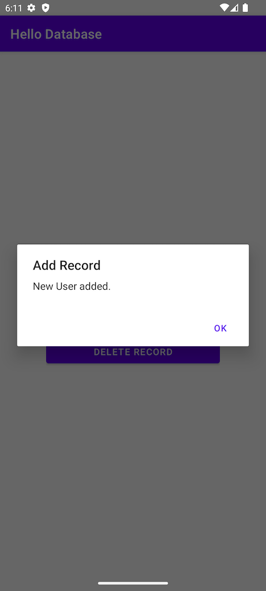
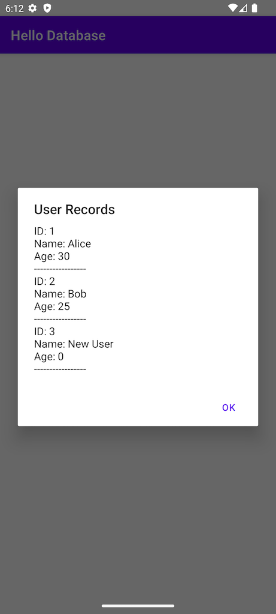

# Overview

A sample application how to work with SQLite, it allows for simple 
Create, Read, Update, and Delete (CRUD) operations on a database. 

However, it is important to note that this sample does not show error handling nor does is it 
necessarily follow best practices for database management. It is intended to be a simple
example to get you started with the basics of database operations.

# Screenshots

## Main Screen

## Select users
After clicking the SELECT USERS button, the app will display all users in the database.

## Update user
Although the app does not have complex error handling, there are some basic checks in place.
For example, if you try to update a user that does not exist, the app will display an error message.

## Add user
A user is added to the database

## All users
After adding a user, you can see the user in the list of all users.

