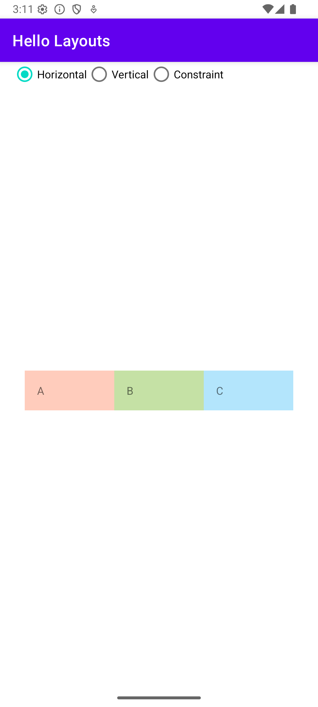
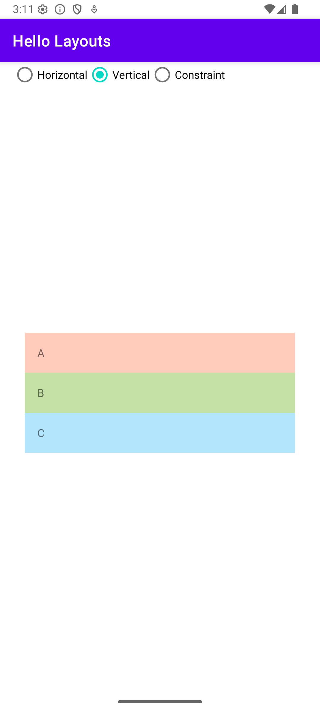
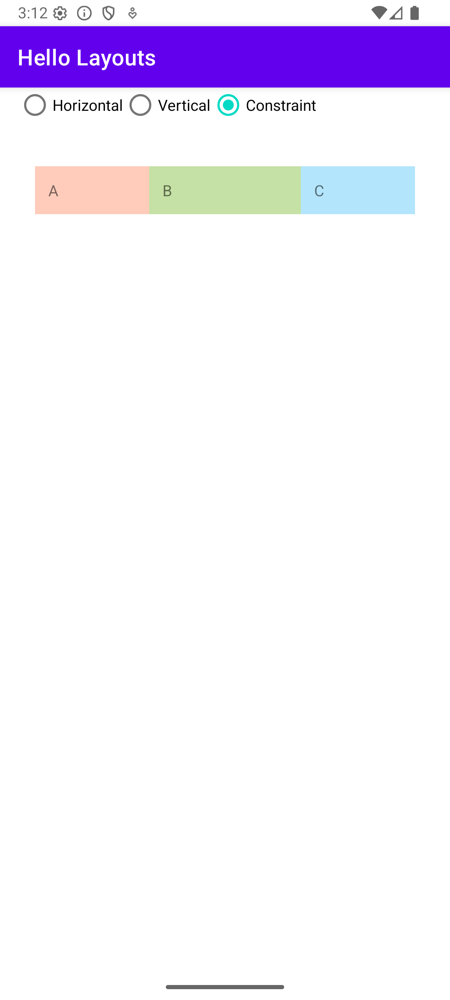
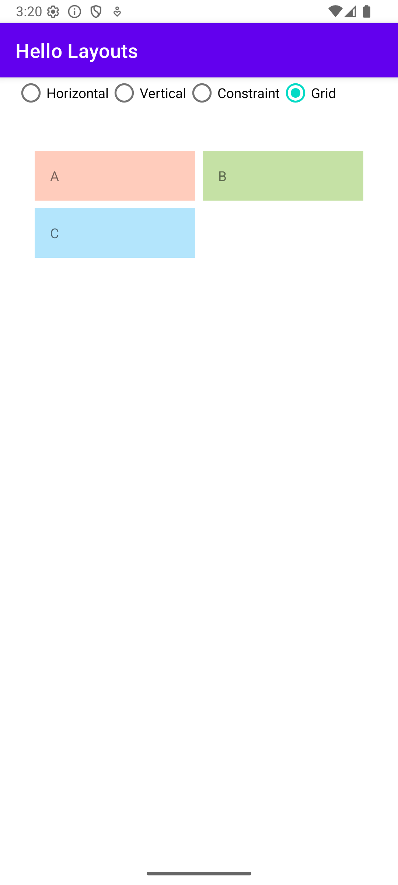

# Overview

A sample app that shows how different layouts can be used.  Three layouts are demonstrated:
* Horizontal layout
* Vertical layout
* Constraint layout
* Grid layout

# Screenshots

## Horizontal Layout

## Vertical Layout

## Constraint Layout

## Grid Layout

