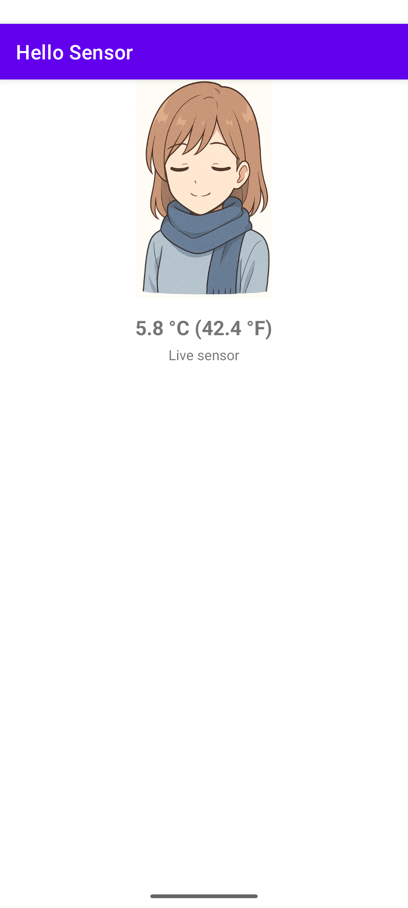
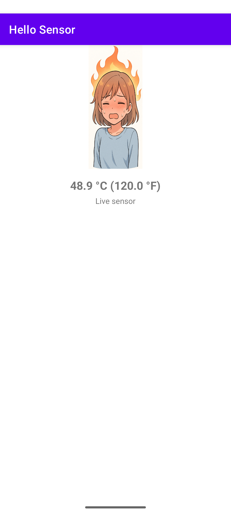

# Overview

A sample app that demonstrates how to read data from a sensor and display it on the screen.

We use the ambient temperature sensor on the device to read the temperature and display it on the screen.
Along with an image that corresponds to the temperature.

# Screenshots

## Cold

## On fire

