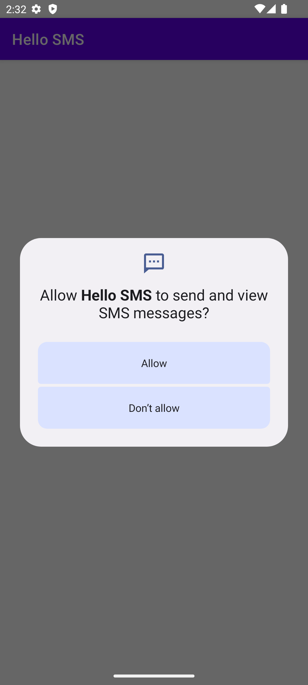

# Overview

A sample app that uses requests permission to send SMS messages and then sends a message.

This is not expected to actually send a message (when running in the emulator) but will demonstrate
the permission request and sending process.

A toast message will be shown indicating success or failure.

Note, that after granting permission and you want to test again you will need to either:

* Revoke the permission in the app settings
* Uninstall and reinstall the app

# Screenshots

## Main Screen

The main screen has a button to send the SMS message.

## Permission Request

When the button is clicked the first time the app will request permission to send SMS messages.

