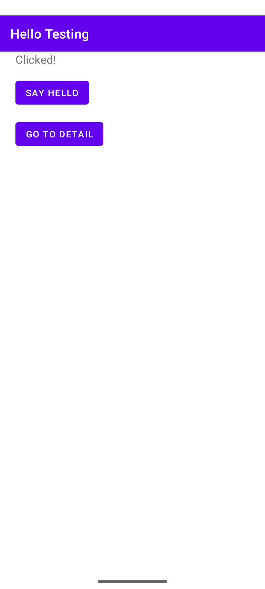
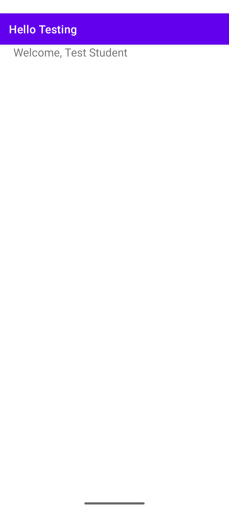
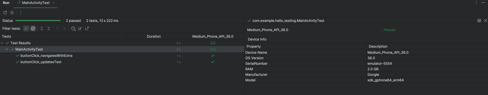
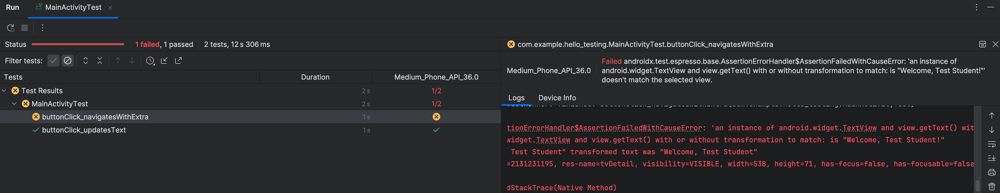

# Overview

A sample app that has a "SAY HELLO" button.  When clicked the text view will change from
"Ready" to "Clicked!".

There is also a "GO TO DETAIL" button that will navigate to a detail screen that says 
"Welcome, Test Student"

# Screenshots

## Main Screen
The main activity screen

## Clicking Say Hello
After clicking the "SAY HELLO" button

## Detail Screen
The detail activity screen

# Test Results

Running MainActivityTest

All the tests are successful

After changing one of the tests to expect a different string, the test fails

