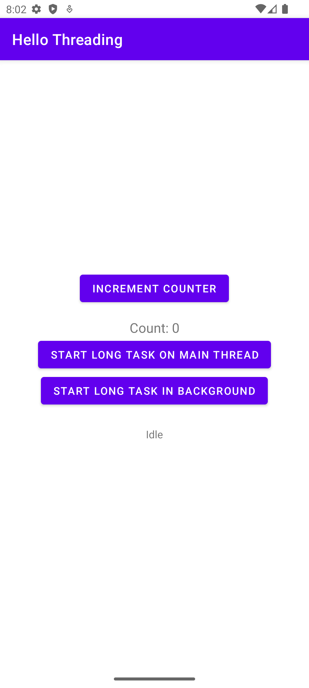
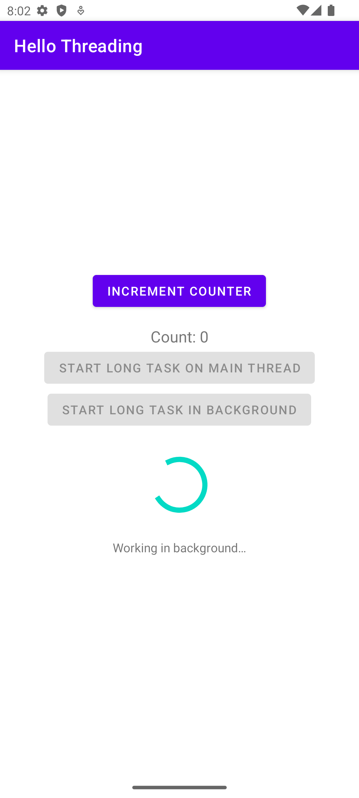

# Overview

Sample app demonstrating threading, the app will simulate a long running task in 
the background as well as in the main activity.

Pressing the "START LONG TASK ON MAIN THREAD" button will block the UI for 5 seconds,
while pressing the "START LONG TASK ON BACKGROUND THREAD" button will run the task in
the background, allowing the UI to remain responsive.

When the task is running in the background you will see:
* A progress bar indicating the task is running
* A message indicating the task is running
* The buttons will be disabled
* The "INCREMENT BUTTON" counter will remain response and increment the count 

When the task in running in the main thread you will see the opposite:
* The progress bar never appears
* The buttons are not disabled
* The message does not change
* The "INCREMENT BUTTON" counter will not increment until the task is complete

# Screenshots

## Main Screen

This is the main screen of the app

## Long Task Running in Background

After pressing the "START LONG TASK ON BACKGROUND THREAD" button, the long task
will run in the background, allowing the UI to remain responsive.

