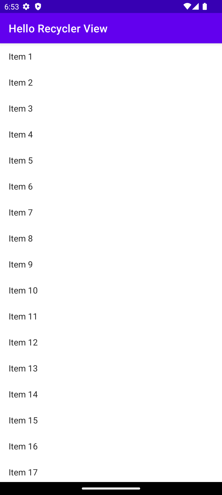

# Overview

A simple app to demonstrate the use of RecyclerView in Android.

Uses a RecyclerView to display a list of "Item #" messages, the app will create 100 messages
to display.

Note that we must add the RecyclerView dependency to our build.gradle file:

```groovy
dependencies {
    implementation libs.recyclerview
}
```


